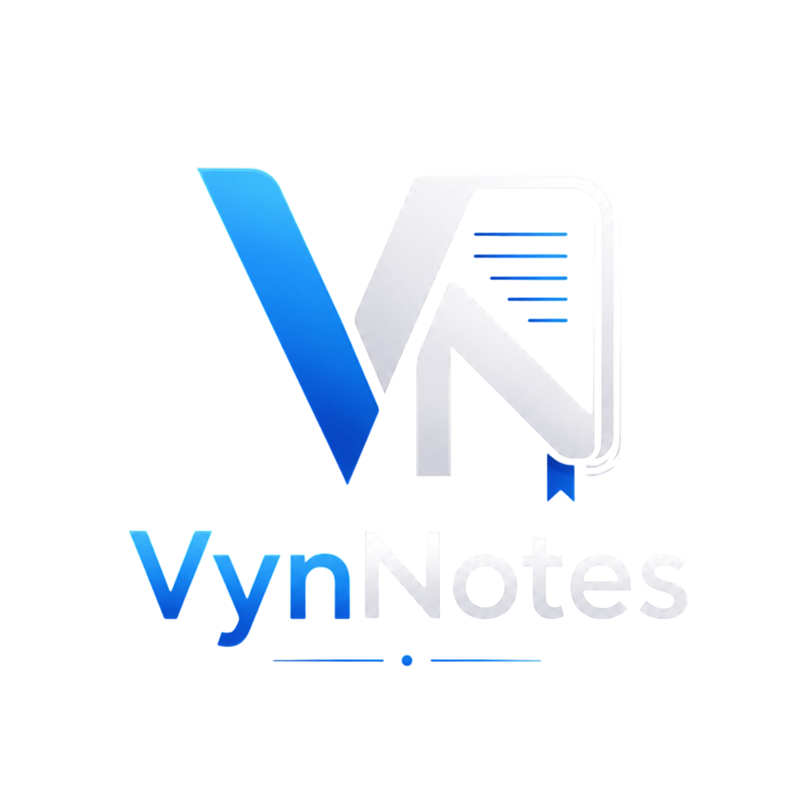

# 🧠 VynNotes

<p align="center">
  
</p>

<p align="center">
  
</p>

<p align="center">
  <strong>Write. Think. Win.</strong>
</p>

<p align="center">
  Built by M.Kishore — a personal AI note-taking project.
</p>

---

## 🚀 Overview

**VynNotes** is a simple, personal AI note-taking app built for speed and clarity.
It is intentionally lightweight and focused on personal productivity, not on workspace or collaboration features.

---

## 💡 Motivation

This project exists to solve a personal need:
- a clean note editor for problem solving
- a chance to learn **Streamlit** and Python UI development
- a second project outside the Telegram bot ecosystem

It is not meant to become a full Notion clone. It is a compact tool for personal use.

---

## 🌐 Demo

A live demo is available at: **[Vyn-Notes](https://vyn-notes.streamlit.app/)**

> This is a personal project, not a production workspace.

---

## ⚙️ Tech Stack

- **Python** – Core application logic
- **Streamlit** – Lightweight UI and quick deployment
- **MongoDB** – Persistent note storage
- **Groq API** – AI-powered note assistance

---

## 🚀 Quick Setup

```bash
git clone https://github.com/lib-kishore/Vyn-Notes.git
cd Vyn-Notes
python -m venv .venv
# Windows
.\.venv\Scripts\activate
# macOS / Linux
source .venv/bin/activate
pip install -r requirements.txt
copy .env.example .env  # Windows
cp .env.example .env    # macOS / Linux
```

Then open `.env` and add your values for:
- `MONGODB_URI`
- `MONGODB_DB`
- `MONGODB_NOTES_COLLECTION`
- `MONGODB_CHATS_COLLECTION`
- `GROQ_API_KEY`

---

## 🔧 Run Commands

```bash
streamlit run note.py
python reset_db.py
```

Use `streamlit run note.py` to start the app. Use `python reset_db.py` to clear all notes and chat history.

---

## ✨ Features

- AI-assisted note editing and chat responses
- Minimal note editor with instant saving
- Persistent notes stored in MongoDB
- Simple recent note navigation and search
- Download notes as Markdown
- Streamlit-based UI for local use and easy hosting

---

## ⚠️ Important Notes

- Single-user, personal-use design only
- No user authentication or multi-user support
- No complex workspace, folders, or team features
- Limited formatting by design
- Not intended to replace full productivity suites

> The goal is personal simplicity, not feature overload.

---

## 🤝 Notes for Contributors

VynNotes is open-source and welcomes improvements.
If you contribute, please preserve the core vision:
- simple and clean
- focused on personal workflows
- easy to understand and maintain

---

## 📌 Project Status

🛠️ Personal project — stable enough for daily use, but still learning and evolving.

---

## 📜 Philosophy

> Keep it simple. Keep it useful.

---

## 📬 Closing

VynNotes is a personal project, not a Notion replacement.
It is built to help you capture ideas quickly and learn Streamlit with a lightweight AI note workflow.
